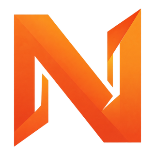
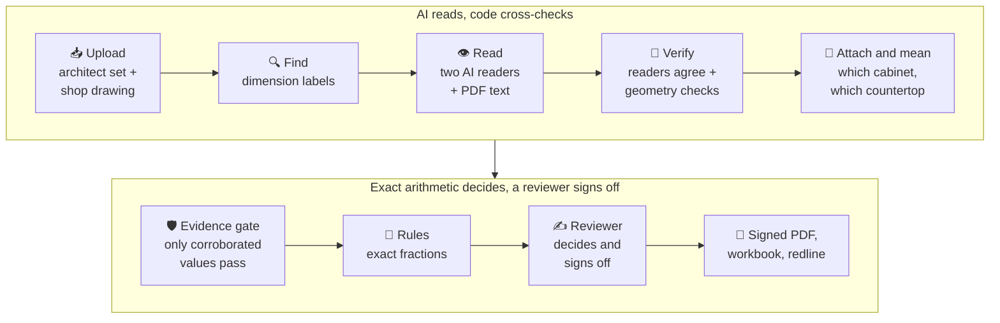

<div align="center">

<a href="https://nexolvai.com"></a>
&nbsp;&nbsp;&nbsp;

&nbsp;&nbsp;&nbsp;


# GV Review

**AI-assisted shop-drawing review for Graniti Vicentia, built by Nexolv AI.**

The AI reads the drawings. Exact arithmetic decides. A reviewer signs off.

[](#-v1-at-a-glance)
[](#-tech-stack)
[](#-tech-stack)
[](#-tech-stack)
[](#-tech-stack)
[](#-tech-stack)
[](#-tech-stack)

[What it does](#-what-it-does) ·
[How a review works](#-how-a-review-works) ·
[Safety](#%EF%B8%8F-the-safety-rule) ·
[V1](#-v1-at-a-glance) ·
[Tech stack](#-tech-stack) ·
[Quickstart](#-quickstart) ·
[Docs](#-documentation)

</div>

---

## 🧭 What it does

A millwork vendor sends Graniti Vicentia (GV) a **shop drawing**: the detailed drawing of the cabinets
and stone countertops they are about to build. Before anything is cut, a GV reviewer has to check
every dimension against the **architect's drawings** and **GV's own standards** (sink offsets,
cut-out clearances, filler sizes). By hand that takes hours per package, and one missed number costs
real money on site.

GV Review does the reading and the checking, and leaves the judgement to the reviewer:

1. 📥 **Takes two PDFs:** the architect's set and the vendor's shop drawing.
2. 👁️ **Reads every dimension** off the drawing, with two independent AI readers plus the PDF's own text.
3. 🧮 **Checks each one** against the rulebook with exact fraction arithmetic, never an AI guess.
4. 📍 **Shows the proof:** the page, the spot and the calculation behind every result.
5. ✍️ **Hands the reviewer a short list** of what needs a decision, then records the sign-off.
6. 📄 **Produces the paperwork:** a signed findings PDF, a workbook and a marked-up (redline) drawing for the vendor.

### Four answers, never a guess

| | Outcome | On screen | When |
|:-:|---|---|---|
| ✅ | `PASS` | Looks right | The numbers match exactly. |
| ❌ | `FAIL` | Needs correction | The numbers do not match. |
| ⚠️ | `REVIEW REQUIRED` | Needs your decision | Readers disagree, something is ambiguous, or it needs human judgement. |
| ⏳ | `NOT FOUND` | Waiting on a value | A needed value is missing. It is never turned into a pass. |

---

## 🔄 How a review works



1. 📥 **Upload.** Both PDFs are stored as immutable, hashed versions. Nothing is overwritten; a re-run makes a new version.
2. 🔍 **Find.** Code finds each dimension label, its dimension line and the row it belongs to, straight from the drawing's vector lines.
3. 👁️ **Read.** Each label is cropped, turned upright and sharpened, then read by **two AI models independently**. Where the PDF carries real text, that text is used directly.
4. 🤝 **Verify.** A value counts only when independent readers agree and it fits the drawing's geometry. A stacked fraction, or a crop showing GV's own markup, always goes to a person.
5. 📏 **Attach and mean.** Each value is tied to its dimension line and to the cabinet or countertop it measures.
6. 🛡️ **Evidence gate.** Only corroborated or reviewer-confirmed values may enter a check. Missing becomes `NOT FOUND`; conflicting becomes `REVIEW REQUIRED`.
7. 🧮 **Check.** The published rulebook runs in an isolated verdict engine using exact fractions (`1/8` stays `1/8`, never `0.125`).
8. ✍️ **Decide and sign off.** The reviewer works through the "Needs you" queue, sees each value on the drawing, and signs off. Decisions carry over when an unchanged package is checked again.
9. 📄 **Report.** A signed findings PDF, an Excel workbook and a redline PDF go back to the vendor.

---

## 🛡️ The safety rule

> **The rulebook directs. The AI reads. Code cross-checks. Exact arithmetic decides. A reviewer signs off.**

The worst outcome is a wrong `PASS`: saying "looks right" when it isn't. Everything below exists to
keep that at zero.

1. 🚫 **No path from AI into the verdict.** The verdict engine has no model keys, no search, no memory and no internet. Tests enforce the isolation.
2. 🧾 **Rules are data, not code.** Each rule picks from a fixed list of typed operations. No `eval`, no runnable rule text.
3. 💡 **AI makes suggestions, not facts.** A reading becomes usable only after it is corroborated and passes the evidence gate.
4. ❓ **Missing means `NOT FOUND`; unclear means `REVIEW REQUIRED`.** No invented numbers, and no "the model was confident".
5. 🔎 **Search is advice only.** It can say where to look; it never supplies a number to a check.
6. 👤 **Rules change only with human approval** and a full answer-key re-run, never automatically from corrections.
7. 🗂️ **Everything is versioned:** drawings, readings, rules and results.
8. 🧱 **Drawing text is data, never instructions**, which guards against prompt injection.
9. ⚖️ **No AGPL dependencies.** A licence test fails the build if one appears.
10. 💬 **The AI explains; it never decides.** Chat answers from the stored findings and cannot change an outcome.

---

## 🎯 V1 at a glance

V1 reviews **cabinets and countertops** (millwork). The engine is the same for every product
category; only the checklist changes.

<table>
<tr>
<td width="50%" valign="top">

**✅ In V1**

- 📄 Digital PDFs, with a scanned-page fallback
- 🗄️ Cabinets and stone countertops
- 📐 Two kinds of check: **vendor vs architect**, and **GV standard rules**
- 📍 Evidence-linked findings with the exact page and spot
- 🧑‍💼 Reviewer queue, decisions, corrections and sign-off
- 🖍️ Signed findings PDF, workbook and redline drawing
- 💬 Chat that explains the stored findings
- 📊 Usage page with every AI call and its cost

</td>
<td width="50%" valign="top">

**⏭️ Deferred**

- 💡 Other categories (lighting, seating)
- ☁️ Google Drive connection
- 🏷️ Brand standards, and web search for standards
- 🔗 Linked items (for example a headboard with a mounted light)
- 🕳️ "This drawing is missing X" checks
- 🤖 Automatic rule learning and autonomous approval
- 🏢 Multi-tenant hosting and autoscaling

</td>
</tr>
</table>

### 📋 Checks in the published rulebook

| | Rule | What it checks |
|:-:|---|---|
| 🪨 | `CT-WIDTH-001` | Countertop width |
| 🪨 | `CT-DEPTH-001` | Countertop depth |
| 📐 | `CT-ARCH-WIDTH-001` | Countertop widths match the architect's drawing |
| 🚰 | `CT-SINK-CUTOUT-WIDTH-001` | Sink cut-out width |
| 🚰 | `CT-SINK-CUTOUT-DEPTH-001` | Sink cut-out depth |
| 🚰 | `CT-SINK-OFFSET-FRONT-001` | Sink front offset |
| 🚰 | `CT-BACK-OFFSET-MIN-001` | Countertop back-offset minimum |
| 🗄️ | `CT-SINK-CABINET-WIDTH-001` | Sink cabinet width against its cut-out and clearances |
| 🗄️ | `CAB-FILLER-001` | Cabinet run distribution (fillers) |
| 📐 | `CAB-ARCH-VS-SHOP-001` | Architect versus shop cabinet widths |

Project-specific values (clearances, overhangs, filler limits) are entered by the reviewer per job;
a rule never guesses them. The rule files live in [`rules/rulebook/`](rules/rulebook/).

### 📈 Where V1 stands

- ✅ **Backend V1 complete:** both test drawing sets pass end to end (upload → reading → checks → decisions → sign-off → reports) with **zero wrong readings accepted**.
- ✅ **UI acceptance passed** on both sets, walked through the screens with Playwright.
- ✅ **Vendor-vs-architect check built:** code, both AIs and the reviewer must agree on what is being compared.
- 🚧 **In progress:** a grounded review assistant that answers only from the review's records, with citations.

---

## 🧰 Tech stack

| Layer | Technology |
|---|---|
| 🐍 **Backend API** | Python 3.12 · FastAPI · Pydantic v2 · pydantic-settings · Uvicorn · server-sent events for streamed answers |
| 🗄️ **Data** | PostgreSQL 17 · SQLAlchemy 2 · Alembic · pgvector (meaning search) · pg_trgm (near-spelling search) · full-text search |
| ⚙️ **Workflow** | Hatchet Lite (durable steps) · transactional outbox · idempotent workers and dispatcher |
| 📄 **PDF and vision** | pdfplumber · pypdfium2 · pikepdf · OpenCV · Shapely · RapidOCR (pages with no vector text) |
| 🤖 **AI readers** | Claude Opus 5.5 + Claude Sonnet 5.5 as the independent reader pair, through OpenRouter (Google Vertex, zero data retention); the direct Anthropic API is one setting away |
| ☁️ **Amazon Bedrock** | Kimi + Qwen3-VL form readers · Bedrock models (Nova) for findings narration and the reviewer chat |
| 🧠 **Agent** | LangGraph, bounded: fixed step and retry limits, otherwise the item goes to review |
| 🧮 **Verdict engine** | Python standard library only · typed operation registry · exact `Fraction` / `Decimal` arithmetic · isolated from models, search and network |
| 📑 **Reports** | ReportLab (signed findings PDF) · pypdf (redline) · openpyxl (workbook) |
| 🗃️ **Storage** | Content-addressed artifact store with SHA-256 hashes and signed download links (local disk in development) |
| 🖥️ **Frontend** | React 19 · TypeScript 6 · Vite 8 · Tailwind CSS 4 · Radix UI / shadcn/ui · TanStack Table · Recharts · PDF.js · Lucide icons · Geist + IBM Plex Mono |
| 🔭 **Observability** | OpenTelemetry tracing · per-call model ledger (tokens, latency, cost) behind the Usage page |
| 🧪 **Quality** | pytest (with a PostgreSQL integration suite) · gold-set answer-key harness · Vitest · Testing Library · Playwright · ruff · black · mypy · ESLint · Semgrep · licence and isolation tests |
| 🐳 **Infrastructure** | Docker Compose (PostgreSQL + Hatchet) · GitHub Actions CI · CodeRabbit reviews |

---

## 🗺️ Repository layout

```text
app/          FastAPI control plane: auth, packages, review, chat, usage, audit
workflow/     Hatchet workflows, dispatcher, workers, retries, outbox
extraction/   PDF text, OCR, geometry and the AI reader lanes
evidence/     Normalising, corroborating and gating readings
rules/        Rulebook YAML, schemas, applicability and publication
verdict/      Isolated, deterministic verdict engine and typed operations
units/        Exact units and fractions
retrieval/    Advisory search lanes (IDs, aliases, lexical, vector)
reports/      Signed findings PDF, workbook and redline drawing
eval/         Gold-set harness, metrics and regression gates
storage/      Hashed artifact storage and signed links
frontend/     Reviewer workspace (React, Vite, TypeScript, PDF.js)
alembic/      Database migrations
docs/         Design, ADRs, rule specs and risk controls
tests/        Unit, integration, safety and isolation tests
scripts/      Runbooks, checks and maintenance tools
```

---

## 🚀 Quickstart

**You need:** Python 3.12+, Docker, and Node.js for the frontend. Model keys are needed only for live
AI reading.

```bash
python -m venv .venv && source .venv/bin/activate
```

```bash
make install
```

One command to a working demo (stack, schema, rulebook, API and UI):

```bash
make demo
```

Or step by step:

| Step | Command | What it does |
|:-:|---|---|
| 1 | `make up` | Start PostgreSQL and the Hatchet engine |
| 2 | `make token` | Mint a client token for the worker |
| 3 | `make migrate` | Bring the database to the latest schema |
| 4 | `make serve` | Run the API |
| 5 | `make dispatch` | Run the dispatcher |
| 6 | `make worker` | Run the review worker |

Working on several branches at once? `make worktree NAME=my-branch` gives each checkout its own
database and ports, and `make where` shows them.

---

## 📚 Documentation

| | Document | About |
|:-:|---|---|
| 🤖 | [`AGENTS.md`](AGENTS.md) | The build guide: golden rules, architecture, coding standards, release gates |
| 🤝 | [`CONTRIBUTING.md`](CONTRIBUTING.md) | How work is run: issues, branches, reviews |
| 🏗️ | [`docs/DESIGN.md`](docs/DESIGN.md) | System design overview |
| 📜 | [`docs/RULE_ENGINE_SPEC.md`](docs/RULE_ENGINE_SPEC.md) | Rule schema and typed operations |
| 🎯 | [`docs/GOLD_SET_FORMAT.md`](docs/GOLD_SET_FORMAT.md) | How a reviewed drawing becomes an answer key |
| 🛡️ | [`docs/RISK_CONTROLS.md`](docs/RISK_CONTROLS.md) | The ten risks and what guards each |
| 🧭 | [`docs/adr/`](docs/adr/) | Architecture decision records |

---

<div align="center">


&nbsp;

&nbsp;


<sub>Built by <a href="https://nexolvai.com">Nexolv AI</a> for Graniti Vicentia.</sub>

</div>
